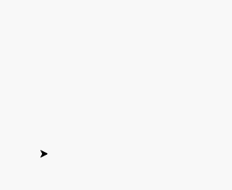
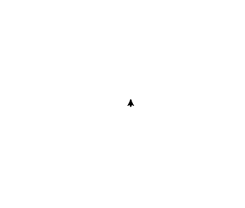
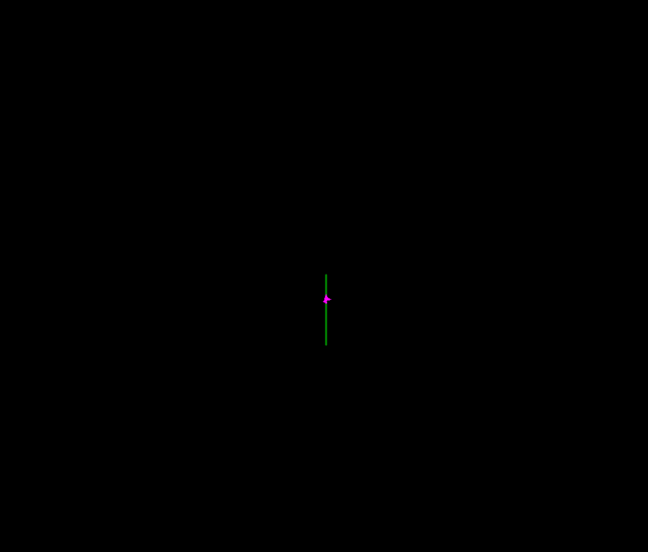
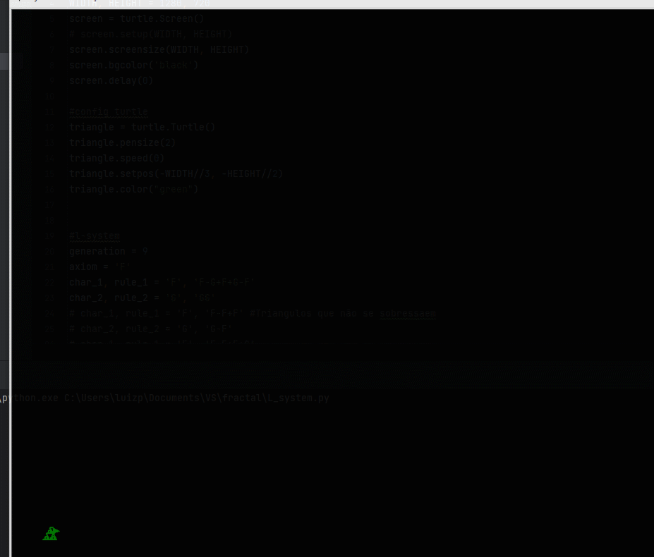
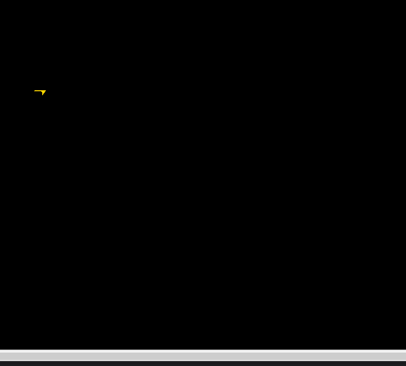

# Fractal

### Explicando um Fractal
Fractal é uma imagem menor que é repetida diversas vezes formando assim uma imagem dela mesmo em um tamanho maior.

Mas e como eu crio meu Fractal? 🤔 
Precisamos entender como a biblioteca [Turtle](https://docs.python.org/3/library/turtle.html) funciona.

Na documentação temos alguns comandos básicos listados, sendo eles: 
    
- turtle.forward()
- turlte.left()
- turtle.right()

Com estes comandos básicos já podemos desenhar um [triângulo](triangle.py).

Ou ainda... (algo como uma "[espiral](intro_turtle.py)") 

E por fim algo mais complexo, talvez um projeto de "[árvore](turtle_tree.py)"[.](https://youtu.be/j6q4FC_g6d0?t=14)

### Criando um Fractal

Utilizando as regras dos fractais e a bilbioteca Turtle, podemos criar o seguinte [fractal](L_system.py)

Um exemplo de Fractal famoso é o [floco de gelo](L-system_2.py)

~~⚠️Easter Egg Alert⚠️~~